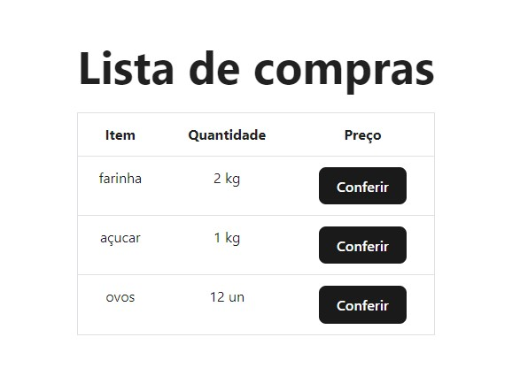

# Atividade Prática - Introdução React

## Definições
1. Baixe o zip com o projeto base.
2. A partir do projeto base adicione o react-router-dom e crie páginas.
3. Crie ao menos 3 páginas e adicione redirecionamento para elas.
4. Utilize props para enviar informações a outros componentes

## Resultado do Front-end

### Home

### Página interna

